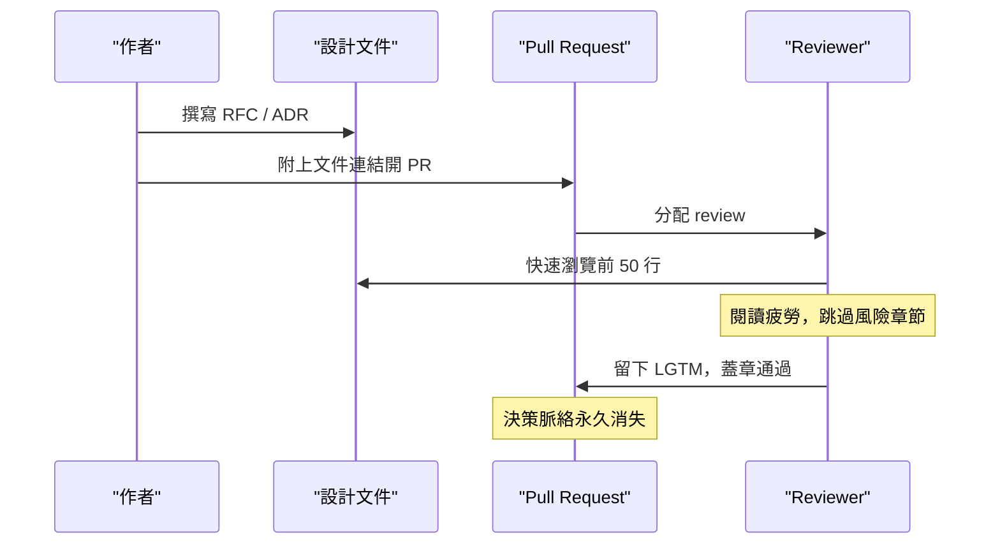
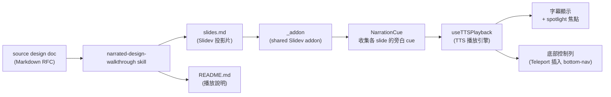

## 2. 問題（Problem）

一個中型專案在兩年內累積 50 份以上的 RFC、ADR 與技術設計文件並不罕見。問題不在於文件存在，而在於沒有人真的有時間讀完。

這導致三個症狀：第一，PR review 退化成橡皮圖章——reviewer 在排程壓力下掃描前 50 行，留下「LGTM, looks fine」就蓋章，決策脈絡與 trade-off 永久消失。第二，閱讀疲勞使「風險」章節和「未解決問題」被跳過，偏偏這兩段最需要被質疑。第三，新進工程師 onboarding 卡關——文件清單缺乏脈絡指引，新人要麼重新發明輪子，要麼不敢碰任何「有歷史」的模組。

根源是格式不匹配：設計文件以靜態散文組織，但工程師吸收資訊的管道是對話與聆聽。

---

## 3. Goals

**(a) 8–12 分鐘、音頻優先的 review 體驗。** 讓 reviewer 可以戴上耳機、在非桌面場景完成一份技術文件的 review；旁白長度控制在 8 到 12 分鐘，覆蓋所有關鍵決策。

**(b) 保留視覺上下文：slides 搭配 spotlight 讓重要元素在被提及時真的亮起。** spotlight 機制讓 diagram 中的特定節點在旁白說到時產生視覺焦點，音頻與視覺同步，彌補純聆聽的空間感缺失。

**(c) 衍生品，不取代 RFC。** walkthrough 從既有設計文件自動生成，工程師繼續在 RFC 或 ADR 上進行正式評審。

---

## 4. Non-goals

- 不取代 RFC 或 ADR：最終技術決策仍以原始設計文件為準。
- 不是行銷等級的影片：不追求專業配音或品牌視覺一致性。
- 不支援協作編寫：slides.md 由 skill 單次生成，無多人即時編輯流程。

---

## 5. 現狀 flow

以下 sequence diagram 描述目前設計文件在 PR review 流程中的典型路徑：

這個 flow 的核心問題是：reviewer 的輸入只有靜態文字，沒有任何機制引導他們關注哪些部分最重要、哪些決定最需要被質疑。

---

## 6. 提案架構

以下 flowchart 描述本 skill 的整體資料流與元件關係：

核心流程分兩段。上游是 skill 讀入設計文件，產出兩個靜態檔案：`slides.md` 包含所有投影片內容與旁白腳本，`README.md` 提供啟動說明。下游是 `_addon` 在 Slidev dev server 運行時提供播放能力：`NarrationCue` 元件負責在每張 slide 的 mount 生命週期收集旁白文字，`useTTSPlayback` 組合式函式驅動瀏覽器 Web Speech API，並同步更新字幕顯示與 spotlight 狀態。

---

## 7. 架構決策（schema-heavy 主軸）

### D1：NarrationCue 使用 Map 而非 Stack

**決定：** `NarrationCue` 以 `(slidePage, text)` 的形式將旁白存入一個 keyed Map，key 為 `useSlideContext().$page` 的當前頁碼值。

**為什麼：** Slidev 在執行 slide transition 時，會預先 mount 相鄰的 slide 元件以準備動畫幀。若改用 stack（push/pop）結構，transition 期間最後被 mount 的 cue 會覆蓋 stack 頂端，導致播放引擎讀到的是「即將出現的下一張」而非「使用者當前看到的這一張」。Map 以頁碼為 key，每次播放只查詢 `currentPage`，完全迴避這個 race condition。

### D2：addon 路徑使用 `./_addon` 而非 `../_addon`

**決定：** `slides.md` 的 frontmatter 中 addons 欄位寫 `./_addon`。

**為什麼：** Slidev 在解析 addon 路徑時，基準目錄是執行 `npm run dev` 時的 working directory，即 `docs/walkthroughs/`，而不是 `slides.md` 檔案本身所在的子目錄。如果寫 `../_addon`，路徑會上溯到 `docs/`，找不到 addon。使用 `./_addon` 確保從正確的 cwd 相對定位。

### D3：spotlight 使用雙軌設計（markup + DOM attribute）

**決定：** 旁白文字中使用 `[h:id]…[/h]` markup 標記要 spotlight 的片段，對應的 DOM 元素則標記 `data-walkthrough-anchor="id"`。

**為什麼：** TTS 播放前，markup 會先被 strip 掉，讓語音引擎收到乾淨的純文字，避免唸出標記符號。同時，播放引擎在 strip 過程中解析出 id，並在播放到對應片段時為 DOM 元素添加 spotlight class。這個雙軌設計的必要性在於：旁白邏輯（什麼時候說到哪個元件）和視覺焦點（哪個 DOM 節點要亮起）必須同步，但瀏覽器的 Speech Synthesis API 不接受嵌入式 UI 控制指令，只能從外部驅動。

### D4：TTS 控件使用 Vue Teleport 插入 bottom-nav

**決定：** TTS 播放控件（播放、暫停、速度）透過 Vue `<Teleport>` 物理插入 Slidev 的底部導航列，而非透過 NavControls.vue override。

**為什麼：** Slidev 的 addon 機制在載入使用者自訂元件時，不會自動偵測並替換 `NavControls.vue`。若在 addon 內放置同名元件，它不會被 pick up，仍然顯示原始的導航列。`<Teleport to=".slidev-nav-controls">` 是唯一能夠在不修改 Slidev 核心的前提下，將控件物理插入已存在 DOM 節點的方式，也是目前 Slidev addon 生態中唯一可行的接合點。

---

## 8. Narration 哲學（process-heavy 主軸）

**Persona 設定：** 旁白者是一位資深工程師，正在向架構審查委員會 brief 一個重要的技術決策。這個 persona 有三個關鍵行為特徵。

第一，**決策優先**：先說結論，再解釋依據，不從背景鋪陳開始。工程師在時間壓力下做 review，他們需要先知道「你做了什麼決定」，才能決定是否要深入聽理由。

第二，**風險自承**：主動點出這個決策的弱點和替代方案被排除的原因。資深工程師不會等 reviewer 挑毛病，他們預先應對反駁，這讓 reviewer 更容易信任這份評估是誠實的。

第三，**舞台指示錨定**：使用 `[h:id]` markup 讓旁白在提到特定元件時與投影片視覺同步，旁白不能比視覺「跑在前面」或「落在後面」。

**禁止語氣模式：** 純字幕複讀（「如投影片所示…」）、artifact meta（「這份 walkthrough 是…」）、第二人稱說教（「請 reviewer 注意…」）、平鋪列點。

**為什麼選這個 persona：** 工程師對行銷語氣有天然的抗拒，刻意親切的旁白反而降低可信度。資深工程師 brief 的語氣——直接、有立場、預先承認弱點——更符合技術 reviewer 的期待。

---

## 9. 風險 & 驗證

**R1：瀏覽器 TTS 中文語音差異。** Edge（Windows）最佳，Safari（macOS）普通，Linux Chrome 不一定內建中文語音。緩解：播放前檢查語音清單，無中文語音時顯示明確警告。

**R2：chunking 演算法對長句的弱點。** 邏輯依賴終止符號決定 spotlight 切換點，無標點的技術縮寫列表無法斷句，導致整段播完才觸發 spotlight。緩解：每 30 字強制插入一個 markup 錨點。

**R3：sample 與 skill 漂移。** skill 格式更新後 sample 無聲過時，新 contributor 會參考錯誤範例。緩解：PR template 加手動 checkbox「是否需要重新 regenerate」，CI 加 frontmatter schema 驗證。

**驗證方式：** `npm run validate` 檢查 schema 與 markup 語法；dev server 手動 smoke test 覆蓋三個場景：title slide 自動播放、Mermaid slide spotlight 觸發、phase slide 切換重置播放狀態。

---

## 10. 下一階段 plan（未承諾時間表）

以下四個 phase 代表潛在演進方向，尚未排入任何 milestone。

**Phase A：skill 確定性 CLI。** 將旁白生成改為固定模板 CLI，輸出可預測，解鎖 CI 強制同步：修改設計文件的 PR 若未重新生成 walkthrough，CI 將阻擋合併。

**Phase B：headless 錄影 pipeline。** Playwright + 虛擬音訊裝置自動錄製 slides 與旁白的同步影片，reviewer 無需 dev server 直接播放影片完成 review。

**Phase C：多 voice mapping。** 為不同 section 類型指定不同語音參數（語速、音調），讓旁白結構更有層次感。

**Phase D：walkthrough 多語自動切換。** 以單一設計文件為 source，自動生成繁中與英文兩份旁白，無需維護兩套平行文件。
