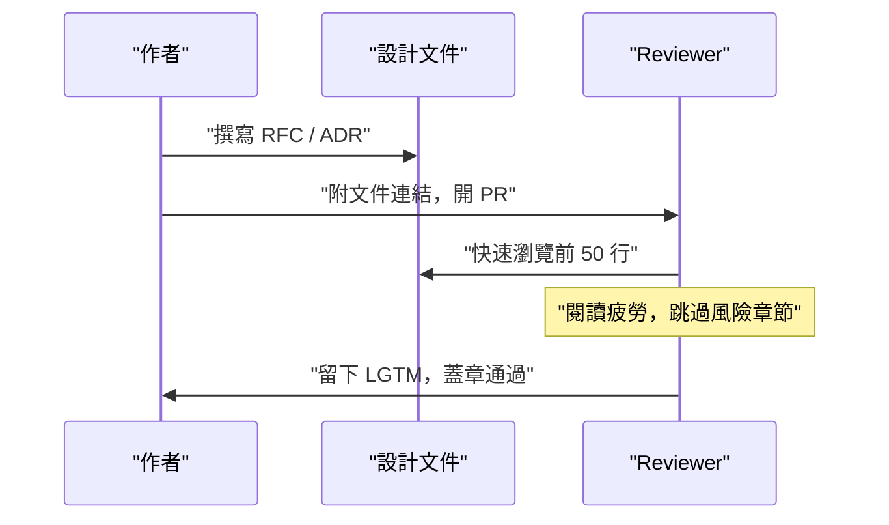
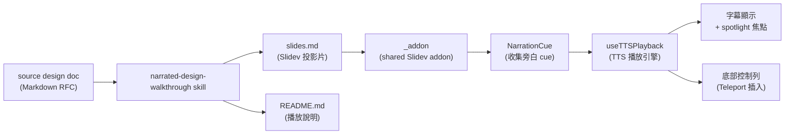

# 設計文件太多看不完？用 AI 生成 8 分鐘可收聽 Walkthrough

narrated-design-walkthrough skill 架構設計

sourceDesign: docs/design/2026-05-21-narrated-design-walkthrough-architecture.md 
sourcePlan: N/A 
status: generated-derivative 
lastRegenerated: 2026-05-21

<NarrationCue :text="`我們在這份 walkthrough 裡要討論的是：為什麼一個中型工程團隊需要「可收聽的設計文件」，以及我們如何設計這個系統。我最想讓你先建立的直覺是：這不是一個錄音工具，而是一個旁白對齊引擎——讓說話的時機和投影片上亮起的節點同步。`" />

<!--
我們在這份 walkthrough 裡要討論的是：為什麼一個中型工程團隊需要「可收聽的設計文件」，以及我們如何設計這個系統。我最想讓你先建立的直覺是：這不是一個錄音工具，而是一個旁白對齊引擎——讓說話的時機和投影片上亮起的節點同步。
-->

---

# 問題：設計文件的閱讀失效

根源不是文件太多，而是格式不匹配——工程師靠對話和聆聽吸收資訊，靜態散文對他們沒效。

  

    <strong>PR 退化成橡皮圖章</strong>
    
排程壓力下掃描前 50 行就蓋章，決策脈絡與 trade-off 永久消失。

  

  

    <strong>閱讀疲勞跳過關鍵段</strong>
    
「風險」與「未解決問題」章節被最需要被質疑，卻最常被跳過。

  

  

    <strong>新人 onboarding 卡關</strong>
    
文件缺乏脈絡指引，新人要麼重造輪子，要麼不敢碰有歷史的模組。

  

<NarrationCue :text="`我們決定要解的問題是：[h:card-rubber-stamp]PR review 退化成橡皮圖章[/h]。這不是 reviewer 不負責任——是靜態文字給不了引導。[h:card-fatigue]閱讀疲勞讓風險章節最先被跳過[/h]，偏偏那段最需要被挑戰。[h:card-onboarding]新人卡關[/h]是這三個症狀裡最容易被忽視的，但它的複利代價最高。我們的判斷是：這三個問題的共同根源是格式不匹配，所以我們從格式下手。`" />

<!--
我們決定要解的問題是：[h:card-rubber-stamp]PR review 退化成橡皮圖章[/h]。這不是 reviewer 不負責任——是靜態文字給不了引導。[h:card-fatigue]閱讀疲勞讓風險章節最先被跳過[/h]，偏偏那段最需要被挑戰。[h:card-onboarding]新人卡關[/h]是這三個症狀裡最容易被忽視的，但它的複利代價最高。我們的判斷是：這三個問題的共同根源是格式不匹配，所以我們從格式下手。
-->

---

# 現狀：設計文件在 PR review 中的典型路徑

這個 flow 的問題是：reviewer 的輸入只有靜態文字，沒有任何機制引導他們關注最重要的決策。

<NarrationCue :text="`這個 sequence 讓我最在意的是中間那段：reviewer 快速瀏覽前 50 行，然後閱讀疲勞讓他跳過風險章節。注意這不是個人習慣問題——是系統沒有給他工具去區分「哪段最需要注意」。我們沒有辦法讓 reviewer 讀更多，但我們可以讓聆聽比閱讀更容易導向關鍵決策。`" />

<!--
這個 sequence 讓我最在意的是中間那段：reviewer 快速瀏覽前 50 行，然後閱讀疲勞讓他跳過風險章節。注意這不是個人習慣問題——是系統沒有給他工具去區分「哪段最需要注意」。我們沒有辦法讓 reviewer 讀更多，但我們可以讓聆聽比閱讀更容易導向關鍵決策。
-->

---

# Goals & Non-goals

  

    
Goals

    

      <strong>8–12 分鐘音頻優先</strong>
      
戴耳機、離桌完成 review；旁白覆蓋所有關鍵決策。

    

    

      <strong>視覺 spotlight 同步</strong>
      
旁白說到哪個節點，那個節點就亮起——音頻與視覺同步，補聆聽的空間感缺失。

    

    

      <strong>衍生品，不取代 RFC</strong>
      
從既有設計文件自動生成；工程師繼續在 RFC / ADR 上正式評審。

    

  

  

    
Non-goals

    

      <strong>不取代 RFC / ADR</strong>
      
最終技術決策仍以原始設計文件為準。

    

    

      <strong>不是行銷影片</strong>
      
不追求專業配音或品牌視覺一致性。

    

    

      <strong>不支援協作編寫</strong>
      
slides.md 單次生成，無多人即時編輯流程。

    

  

<NarrationCue :text="`我想特別說明 [h:card-goal-derivative]衍生品這個 goal[/h]——我們刻意讓 walkthrough 是消費端，不是規格真相。這讓我們不需要維護一致性的負擔。[h:card-ng-replace]Non-goal 那側最重要的也是這點[/h]：不取代 RFC 不只是邊界宣告，而是故意保留的設計空間——如果 walkthrough 可以被 reviewer 寫回去，它就會變成另一個需要治理的文件。我們不要那個複雜度。`" />

<!--
我想特別說明 [h:card-goal-derivative]衍生品這個 goal[/h]——我們刻意讓 walkthrough 是消費端，不是規格真相。這讓我們不需要維護一致性的負擔。[h:card-ng-replace]Non-goal 那側最重要的也是這點[/h]：不取代 RFC 不只是邊界宣告，而是故意保留的設計空間——如果 walkthrough 可以被 reviewer 寫回去，它就會變成另一個需要治理的文件。我們不要那個複雜度。
-->

---

# 提案架構：整體資料流

<NarrationCue :text="`這個 flowchart 分兩段邏輯。上游是 skill：吃進設計文件，吐出 slides.md 和 README.md，就結束了。下游是 _addon 在 Slidev 執行時跑的邏輯：NarrationCue 收集各頁旁白，useTTSPlayback 驅動瀏覽器 Web Speech API，然後字幕和 spotlight 同步更新。我最想讓你記住的是：這兩段是解耦的。skill 產出靜態檔案，addon 在執行期讀它。改 skill 不影響 addon，改 addon 不需要重產投影片。`" />

<!--
這個 flowchart 分兩段邏輯。上游是 skill：吃進設計文件，吐出 slides.md 和 README.md，就結束了。下游是 _addon 在 Slidev 執行時跑的邏輯：NarrationCue 收集各頁旁白，useTTSPlayback 驅動瀏覽器 Web Speech API，然後字幕和 spotlight 同步更新。我最想讓你記住的是：這兩段是解耦的。skill 產出靜態檔案，addon 在執行期讀它。改 skill 不影響 addon，改 addon 不需要重產投影片。
-->

---

# D1：NarrationCue 使用 Map 而非 Stack

決定：以 (slidePage, text) 的形式存入 keyed Map，key 為當前頁碼。

  

    <strong>Map 方案（採用）</strong>
    
每次播放查詢 <code>currentPage</code>，key 固定為頁碼，不受 mount 順序影響。

  

  

    <strong>Stack 方案（排除）</strong>
    
Slidev transition 期間預先 mount 相鄰 slide，最後 push 的 cue 覆蓋 stack 頂端，導致播放引擎讀到下一張的旁白。

  

race condition 發生的時間點：slide transition 動畫幀期間，兩張 slide 同時 mounted。

<NarrationCue :text="`我們決定用 Map 不用 Stack，理由是 [h:card-stack-rejected]Stack 方案的 race condition[/h]：Slidev 在 transition 期間預先 mount 相鄰的 slide 元件。如果用 Stack，transition 動畫跑完之前，下一張 slide 的 NarrationCue 已經 push 進去了。播放引擎就會讀到錯的頁面旁白。[h:card-map-decision]Map 方案用頁碼做 key[/h]，播放時只查 currentPage，完全迴避這個 race。你問為什麼不用其他結構？因為 [h:span-race-condition]問題的核心是「同時 mounted 不代表同時 visible」[/h]，Map 是這個問題最直接的解法。`" />

<!--
我們決定用 Map 不用 Stack，理由是 [h:card-stack-rejected]Stack 方案的 race condition[/h]：Slidev 在 transition 期間預先 mount 相鄰的 slide 元件。如果用 Stack，transition 動畫跑完之前，下一張 slide 的 NarrationCue 已經 push 進去了。播放引擎就會讀到錯的頁面旁白。[h:card-map-decision]Map 方案用頁碼做 key[/h]，播放時只查 currentPage，完全迴避這個 race。你問為什麼不用其他結構？因為 [h:span-race-condition]問題的核心是「同時 mounted 不代表同時 visible」[/h]，Map 是這個問題最直接的解法。
-->

---

# D2 & D3：addon 路徑 + spotlight 雙軌設計

  

    <strong>D2：addon 路徑用 <code>./_addon</code></strong>
    
Slidev 以 npm script 的 cwd（即 <code>docs/walkthroughs/</code>）解析 addon 路徑。寫 <code>../_addon</code> 會上溯到 <code>docs/</code>，找不到 addon，啟動即報 ENOENT。

  

  

    <strong>D3：spotlight 雙軌設計</strong>
    
旁白用 <code>[h:id]…[/h]</code> 標記要亮的片段；DOM 元素標記 <code>data-walkthrough-anchor="id"</code>。播放前 markup 先 strip，語音引擎收到乾淨純文字，播放引擎同步驅動 spotlight。

  

瀏覽器 Speech Synthesis API 不接受嵌入式 UI 控制指令，只能從外部驅動——這是雙軌設計的根本原因。

<NarrationCue :text="`這兩個決定放在一起講是因為它們都是「不能偷懶的路徑選擇」。[h:card-addon-path]addon 路徑的 ./_addon[/h]：如果你寫 ../_addon，第一次 npm run dev 就會看到 ENOENT，沒有其他症狀。這不是建議，是唯一能 work 的寫法。[h:card-spotlight-dual]spotlight 雙軌設計[/h] 是我承擔的主要複雜度：維護兩份對應關係，markup 和 anchor 都要一起寫。但 [h:span-why-dual]瀏覽器 TTS API 的限制[/h] 讓我們沒有選擇——它只接受純文字輸入，UI 狀態只能從外部觸發，不能嵌入指令。`" />

<!--
這兩個決定放在一起講是因為它們都是「不能偷懶的路徑選擇」。[h:card-addon-path]addon 路徑的 ./_addon[/h]：如果你寫 ../_addon，第一次 npm run dev 就會看到 ENOENT，沒有其他症狀。這不是建議，是唯一能 work 的寫法。[h:card-spotlight-dual]spotlight 雙軌設計[/h] 是我承擔的主要複雜度：維護兩份對應關係，markup 和 anchor 都要一起寫。但 [h:span-why-dual]瀏覽器 TTS API 的限制[/h] 讓我們沒有選擇——它只接受純文字輸入，UI 狀態只能從外部觸發，不能嵌入指令。
-->

---

# D4：TTS 控件使用 Vue Teleport 插入 bottom-nav

決定：透過 <code>&lt;Teleport to=".slidev-nav-controls"&gt;</code> 物理插入 Slidev 底部導航列，而非 NavControls.vue override。

  

    <strong>Teleport 方案（採用）</strong>
    
在不修改 Slidev 核心的前提下，將控件物理插入已存在的 DOM 節點。addon 機制可自動套用，不需要改動每個 walkthrough。

  

  

    <strong>NavControls.vue override（排除）</strong>
    
Slidev 的 addon 機制不會自動偵測並替換 NavControls.vue。放置同名元件不會被 pick up，原始導航列仍然顯示。

  

<NarrationCue :text="`[h:card-navcontrols-rejected]NavControls.vue override 的方案[/h] 看起來是最自然的 Slidev 擴充點，但我們測試後確認它不 work：addon 機制在這個位置不觸發元件替換。[h:card-teleport-chosen]Teleport 方案[/h] 是目前 Slidev addon 生態中唯一可行的接合點。我承擔的風險是：Slidev 未來更新 DOM 結構後，.slidev-nav-controls 的 selector 可能失效。我們的緩解方式是把 Teleport 邏輯集中在 TTSNavButtons.vue，這樣只需要在一個地方更新 selector。`" />

<!--
[h:card-navcontrols-rejected]NavControls.vue override 的方案[/h] 看起來是最自然的 Slidev 擴充點，但我們測試後確認它不 work：addon 機制在這個位置不觸發元件替換。[h:card-teleport-chosen]Teleport 方案[/h] 是目前 Slidev addon 生態中唯一可行的接合點。我承擔的風險是：Slidev 未來更新 DOM 結構後，.slidev-nav-controls 的 selector 可能失效。我們的緩解方式是把 Teleport 邏輯集中在 TTSNavButtons.vue，這樣只需要在一個地方更新 selector。
-->

---

# Narration 哲學：persona 與禁止語氣

  

    <strong>Persona：資深工程師向架構委員會 brief</strong>
    
<strong>決策優先</strong>：先說結論，再給依據。 
    <strong>風險自承</strong>：主動點出弱點與替代方案被排除的原因。 
    <strong>舞台指示錨定</strong>：<code>[h:id]</code> markup 讓旁白與視覺同步。

  

  

    <strong>禁止語氣模式</strong>
    
✗ 純字幕複讀（「如投影片所示…」） 
    ✗ artifact meta（「這份 walkthrough 是…」） 
    ✗ 第二人稱說教（「請 reviewer 注意…」） 
    ✗ 平鋪列點，不給結論

  

工程師對行銷語氣有天然抗拒。資深工程師 brief 的語氣——直接、有立場、預先承認弱點——才符合技術 reviewer 的期待。

<NarrationCue :text="`我們為什麼要規定 persona？因為 [h:span-persona-why]工程師對行銷語氣的抗拒是真實的[/h]——親切的旁白反而降低可信度。[h:card-persona-rules]資深工程師 brief 的三個特徵[/h]：決策優先、風險自承、舞台指示錨定。這不只是風格規範，它影響 TTS 實際唸出來的句型。[h:card-forbidden-patterns]禁止模式[/h] 裡最容易犯的是「純字幕複讀」——NarrationCue 的內容和投影片文字完全重疊，等於沒有旁白。我們的判斷是：旁白的價值在於加入「為什麼」，不是複讀「是什麼」。`" />

<!--
我們為什麼要規定 persona？因為 [h:span-persona-why]工程師對行銷語氣的抗拒是真實的[/h]——親切的旁白反而降低可信度。[h:card-persona-rules]資深工程師 brief 的三個特徵[/h]：決策優先、風險自承、舞台指示錨定。這不只是風格規範，它影響 TTS 實際唸出來的句型。[h:card-forbidden-patterns]禁止模式[/h] 裡最容易犯的是「純字幕複讀」——NarrationCue 的內容和投影片文字完全重疊，等於沒有旁白。我們的判斷是：旁白的價值在於加入「為什麼」，不是複讀「是什麼」。
-->

---

# 風險 & 驗證

  

    <strong>R1：中文語音差異</strong>
    
Edge 最佳，Safari 普通，Linux Chrome 不一定有中文語音。緩解：播放前檢查語音清單，無中文語音時顯示明確警告。

  

  

    <strong>R2：長句 chunking 弱點</strong>
    
無標點的技術縮寫列表無法斷句，整段播完才觸發 spotlight。緩解：每 30 字強制插入一個 markup 錨點。

  

  

    <strong>R3：sample 與 skill 漂移</strong>
    
skill 更新後 sample 無聲過時。緩解：PR template 加手動 checkbox，CI 加 frontmatter schema 驗證。

  

驗證方式：<code>npm run validate</code> 做 schema 與 markup 語法靜態檢查；dev server 做三個場景的手動 smoke test。

<NarrationCue :text="`這三個風險我都已經有緩解措施，但我要說清楚哪個最讓我在意。[h:card-risk-drift]R3 sample 與 skill 漂移[/h] 是唯一需要流程介入的風險，其他兩個可以靠技術措施緩解。R3 的根本問題是：sample 不會自動感知 skill 更新，而它是新 contributor 最常參考的起點。我們在 PR template 加了 checkbox，但坦白說這是靠人工記憶的緩解，不夠強。[h:span-validate]validate 指令[/h] 是我們目前最可靠的防線：每次改 skill 後先跑驗證，至少能抓到結構性錯誤。`" />

<!--
這三個風險我都已經有緩解措施，但我要說清楚哪個最讓我在意。[h:card-risk-drift]R3 sample 與 skill 漂移[/h] 是唯一需要流程介入的風險，其他兩個可以靠技術措施緩解。R3 的根本問題是：sample 不會自動感知 skill 更新，而它是新 contributor 最常參考的起點。我們在 PR template 加了 checkbox，但坦白說這是靠人工記憶的緩解，不夠強。[h:span-validate]validate 指令[/h] 是我們目前最可靠的防線：每次改 skill 後先跑驗證，至少能抓到結構性錯誤。
-->

---

# 下一階段 plan

  

    
Phase A（當前方向）

    
skill 確定性 CLI

    
旁白生成改為固定模板 CLI，輸出可預測，解鎖 CI 強制同步：修改設計文件的 PR 若未重新生成 walkthrough，CI 阻擋合併。

  

  

    
Phase B（當前方向）

    
headless 錄影 pipeline

    
Playwright + 虛擬音訊裝置自動錄製同步影片，reviewer 無需 dev server 直接播放完成 review。

  

  

    
Phase C（未來選項）

    
多 voice mapping

    
為不同 section 類型指定語速、音調，讓旁白結構更有層次感。

  

  

    
Phase D（未來選項）

    
walkthrough 多語自動切換

    
單一設計文件自動生成繁中與英文兩份旁白，無需維護兩套平行文件。

  

<NarrationCue :text="`四個 phase，尚未排入任何 milestone。我用天藍色標 [h:step-phase-a,step-phase-b]A 和 B[/h] 是因為它們是當前方向，不是已承諾的工作。Phase A 的 CLI 確定性是解鎖 CI 的前提——先有可預測的輸出，才能做強制驗證。[h:step-phase-c,step-phase-d]C 和 D 是琥珀色[/h]，是我們刻意留在門外的延伸。特別是 Phase D 多語切換：技術上不難，但維護複雜度被刻意擋在這版之外，等我們確認核心 persona 在繁中能 work 之後再說。`" />

<!--
四個 phase，尚未排入任何 milestone。我用天藍色標 [h:step-phase-a,step-phase-b]A 和 B[/h] 是因為它們是當前方向，不是已承諾的工作。Phase A 的 CLI 確定性是解鎖 CI 的前提——先有可預測的輸出，才能做強制驗證。[h:step-phase-c,step-phase-d]C 和 D 是琥珀色[/h]，是我們刻意留在門外的延伸。特別是 Phase D 多語切換：技術上不難，但維護複雜度被刻意擋在這版之外，等我們確認核心 persona 在繁中能 work 之後再說。
-->

---
layout: cover
---

# Walkthrough 結束

感謝收聽。這份 walkthrough 的所有架構決策與風險討論，原始依據在 design doc 中。

sourceDesign: docs/design/2026-05-21-narrated-design-walkthrough-architecture.md 
status: generated-derivative

<NarrationCue :text="`我們走過了問題、goals、提案架構、四個關鍵決策、narration 哲學，還有三個風險的緩解方式。這份 walkthrough 是消費端——如果你對任何決策有疑問，請回到 design doc，那才是規格真相。我很歡迎你對架構決策提出挑戰，特別是 D4 Teleport seam 的長期維護問題，那是我目前最沒有把握的部分。`" />

<!--
我們走過了問題、goals、提案架構、四個關鍵決策、narration 哲學，還有三個風險的緩解方式。這份 walkthrough 是消費端——如果你對任何決策有疑問，請回到 design doc，那才是規格真相。我很歡迎你對架構決策提出挑戰，特別是 D4 Teleport seam 的長期維護問題，那是我目前最沒有把握的部分。
-->
