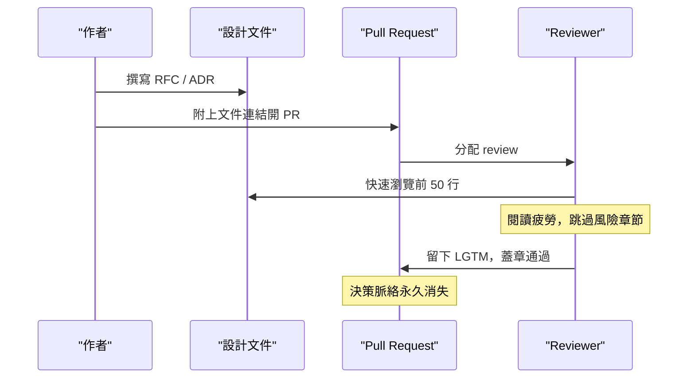
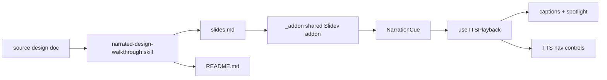

# Narrated Design Walkthrough

架構設計導讀：把靜態設計文件轉成可聽、可指、可驗證的衍生 review artifact

sourceDesign: docs/design/2026-05-21-narrated-design-walkthrough-architecture.md 
sourcePlan: none 
status: generated-derivative · lastRegenerated: 2026-05-21

<NarrationCue :text="`我們決定把 narrated walkthrough 定位成設計文件的衍生 review artifact，而不是新的 source of truth。[h:span-title]標題下面這句話就是邊界：可聽、可指、可驗證[/h]。我保留 [h:card-source]sourceDesign 和 generated-derivative 狀態[/h]，因為這份輸出必須能一路追回 canonical design doc，否則 review 會失去責任歸屬。`" />

<!--
我們決定把 narrated walkthrough 定位成設計文件的衍生 review artifact，而不是新的 source of truth。[h:span-title]標題下面這句話就是邊界：可聽、可指、可驗證[/h]。我保留 [h:card-source]sourceDesign 和 generated-derivative 狀態[/h]，因為這份輸出必須能一路追回 canonical design doc，否則 review 會失去責任歸屬。
-->

---

# Source Boundary

這份 design 是 hybrid：它同時定義生成 artifact 的結構，也定義播放時的 lifecycle 與互動流程。

  

    <strong>Canonical</strong>
    
正式規格仍在 source design doc。問題、目標、non-goals、架構決策、風險與下一階段 plan 都從那份文件抽取。

  

  

    <strong>Derivative</strong>
    
本目錄只保存 slides.md 與 README.md。它服務 async review、onboarding 與 stakeholder explanation，不承擔最終決策記錄。

  

  

    <strong>Schema-heavy 軸</strong>
    
NarrationCue Map、addons 路徑、spotlight markup 與 DOM anchor 都是 contract 決策。

  

  

    <strong>Process-heavy 軸</strong>
    
review 流程、旁白 persona、caption / spotlight 同步、驗證順序都是 lifecycle 決策。

  

<NarrationCue :text="`我把這份 design 分類成 hybrid。[h:card-schema]左下角是 schema-heavy 的軸線[/h]，因為 NarrationCue、addon path、spotlight markup 都是會被程式依賴的 contract。[h:card-process]右下角是 process-heavy 的軸線[/h]，因為它也在規範 review 如何被消費、旁白如何同步、驗證如何進行。這個分類會影響我選哪些圖：只畫靜態結構不夠，也要畫 runtime flow。`" />

<!--
我把這份 design 分類成 hybrid。[h:card-schema]左下角是 schema-heavy 的軸線[/h]，因為 NarrationCue、addon path、spotlight markup 都是會被程式依賴的 contract。[h:card-process]右下角是 process-heavy 的軸線[/h]，因為它也在規範 review 如何被消費、旁白如何同步、驗證如何進行。這個分類會影響我選哪些圖：只畫靜態結構不夠，也要畫 runtime flow。
-->

---

# Problem：文件存在，但沒有人真的讀完

根源不是缺文件，而是靜態散文和工程 review 的實際吸收方式不匹配。

  

    <strong>橡皮圖章 Review</strong>
    
Reviewer 在排程壓力下掃描前 50 行，留下 LGTM，決策脈絡和 trade-off 隨 PR 合併一起消失。

  

  

    <strong>風險章節被跳過</strong>
    
閱讀疲勞讓最需要被質疑的風險和未解問題，反而成為最容易被略過的段落。

  

  

    <strong>Onboarding 卡關</strong>
    
新人看到一串沒有導讀的 RFC / ADR，只能重讀歷史或重新發明輪子。

  

<NarrationCue :text="`我們要解的問題不是文件不足，而是文件的消費方式失效。[h:card-lgtm]左邊這格是最壞的結果：PR review 退化成 LGTM[/h]。風險不是 reviewer 不負責任，而是格式沒有幫他停在正確的位置。[h:card-risk-skip]中間這格更危險，風險章節被閱讀疲勞吞掉[/h]。[h:card-onboarding]右邊這格則是長期成本，新人只看到歷史堆積，沒有脈絡入口[/h]。`" />

<!--
我們要解的問題不是文件不足，而是文件的消費方式失效。[h:card-lgtm]左邊這格是最壞的結果：PR review 退化成 LGTM[/h]。風險不是 reviewer 不負責任，而是格式沒有幫他停在正確的位置。[h:card-risk-skip]中間這格更危險，風險章節被閱讀疲勞吞掉[/h]。[h:card-onboarding]右邊這格則是長期成本，新人只看到歷史堆積，沒有脈絡入口。
-->

---

# Goals / Non-goals：降低消費門檻，不改決策權威

  

    <strong>8-12 分鐘音頻優先</strong>
    
Reviewer 可以戴耳機完成技術設計 review。旁白覆蓋關鍵決策，不要求 reviewer 從頭讀完整篇散文。

  

  

    <strong>保留視覺上下文</strong>
    
Slides 搭配 spotlight，讓 diagram 或卡片在被提到時真的亮起，音頻和視覺同步。

  

  

    <strong>衍生品，不取代 RFC</strong>
    
工程師繼續在 RFC / ADR 上做正式評審。Walkthrough 只降低理解門檻，不重寫決策歷史。

  

  

    <strong style="color: #94a3b8;">Non-goals</strong>
    
不做行銷影片、不追求專業配音、不支援多人即時協作編寫。

  

<NarrationCue :text="`我們的目標是降低 review 消費門檻，不改決策權威。[h:goal-audio]左上角的音頻優先，是為了讓 reviewer 在非桌面情境也能吸收決策[/h]。[h:goal-spotlight]右上角的 spotlight 是關鍵差異[/h]，它避免音頻變成脫離畫面的 podcast。[h:goal-boundary]左下角是我最在意的邊界：walkthrough 不取代 RFC[/h]。因此 [h:goal-nongoals]右下角這些 non-goals 我們刻意不做[/h]，避免把工具推向影片製作或協作編輯器。`" />

<!--
我們的目標是降低 review 消費門檻，不改決策權威。[h:goal-audio]左上角的音頻優先，是為了讓 reviewer 在非桌面情境也能吸收決策[/h]。[h:goal-spotlight]右上角的 spotlight 是關鍵差異[/h]，它避免音頻變成脫離畫面的 podcast。[h:goal-boundary]左下角是我最在意的邊界：walkthrough 不取代 RFC[/h]。因此 [h:goal-nongoals]右下角這些 non-goals 我們刻意不做[/h]，避免把工具推向影片製作或協作編輯器。
-->

---

# Current Flow：靜態文字沒有導覽機制

缺口：reviewer 只有靜態文字輸入，沒有機制指出「哪裡最重要」與「哪個決定最該被挑戰」。

<NarrationCue :text="`我們先看現狀 flow。[h:diagram-current]這條路徑從作者寫 RFC，到 PR 分配 review，中間沒有任何導覽層[/h]。Reviewer 只能用自己的疲勞程度決定讀到哪裡。[h:card-current-gap]下面這個缺口才是我們要補的地方[/h]：系統沒有指出哪個決策最重要，也沒有把風險拉到 reviewer 面前。`" />

<!--
我們先看現狀 flow。[h:diagram-current]這條路徑從作者寫 RFC，到 PR 分配 review，中間沒有任何導覽層[/h]。Reviewer 只能用自己的疲勞程度決定讀到哪裡。[h:card-current-gap]下面這個缺口才是我們要補的地方[/h]：系統沒有指出哪個決策最重要，也沒有把風險拉到 reviewer 面前。
-->

---

# Proposed Architecture：生成端與播放端解耦

  

    <strong style="color: #7dd3fc;">上游：Skill 生成靜態 artifact</strong> 
    讀取 source design，產出 slides.md 與 README.md，不複製播放引擎。
  

  

    <strong style="color: #fcd34d;">下游：_addon 提供 runtime 能力</strong> 
    在 Slidev dev server 中處理 narration、Web Speech、captions、spotlight 與 nav controls。
  

<NarrationCue :text="`我們的架構決策是把生成端和播放端解耦。[h:card-upstream]左下角的上游只負責產出 slides.md 和 README.md[/h]，所以新 walkthrough 不需要複製 runtime。[h:card-downstream]右下角的下游集中在 shared _addon[/h]，它在 Slidev 裡接管 narration、字幕、spotlight 和控制列。這樣設計的風險是 addon 變成共享核心；我用 validate 和 live preview 來守住 contract。`" />

<!--
我們的架構決策是把生成端和播放端解耦。[h:card-upstream]左下角的上游只負責產出 slides.md 和 README.md[/h]，所以新 walkthrough 不需要複製 runtime。[h:card-downstream]右下角的下游集中在 shared _addon[/h]，它在 Slidev 裡接管 narration、字幕、spotlight 和控制列。這樣設計的風險是 addon 變成共享核心；我用 validate 和 live preview 來守住 contract。
-->

---

# Runtime Ownership：每個元件只擁有一件事

  

    <strong>Source Doc</strong>
    
擁有決策內容與技術真相。Walkthrough 只能引用和轉譯，不應修改它。

  

  

    <strong>slides.md</strong>
    
擁有可視內容、NarrationCue、speaker notes、data-walkthrough-anchor。

  

  

    <strong>_addon</strong>
    
擁有 TTS state、caption window、spotlight DOM updates、Slidev nav Teleport。

  

  

    <strong>Validator</strong>
    
先擋 frontmatter、Mermaid、deprecated TTS component 這些結構錯誤。

  

  

    <strong>Future CLI / Recording</strong>
    
未來才把 determinism、CI 同步、headless recording 拉進正式 pipeline。

  

<NarrationCue :text="`我把 ownership 切得很窄。[h:step-source]左上角的 source doc 擁有技術真相[/h]，walkthrough 不能反過來改寫它。[h:step-slides,step-addon]中間兩格是目前的核心：slides.md 擁有內容和 anchor，_addon 擁有播放狀態[/h]。這個分工讓錯誤比較容易定位。[h:step-validator]左下角 validator 先抓結構錯誤[/h]。[h:step-future]右下角琥珀色那格我刻意標成 future[/h]，因為 CLI determinism 和錄影 pipeline 還不是現在的承諾。`" />

<!--
我把 ownership 切得很窄。[h:step-source]左上角的 source doc 擁有技術真相[/h]，walkthrough 不能反過來改寫它。[h:step-slides,step-addon]中間兩格是目前的核心：slides.md 擁有內容和 anchor，_addon 擁有播放狀態[/h]。這個分工讓錯誤比較容易定位。[h:step-validator]左下角 validator 先抓結構錯誤[/h]。[h:step-future]右下角琥珀色那格我刻意標成 future[/h]，因為 CLI determinism 和錄影 pipeline 還不是現在的承諾。
-->

---

# D1：NarrationCue 用 Map，不用 Stack

Slidev transition 會預先 mount 鄰近 slides；Stack 會讀到最後 mount 的 cue，而不是當前可見頁。

  

    <strong>選擇：Map keyed by slidePage</strong>
    
NarrationCue 用 useSlideContext().$page 作為 key。播放時由 currentSlideNo 查表，取得可見 slide 的 narration。

  

  

    <strong style="color: #94a3b8;">排除：Stack push / pop</strong>
    
Transition 期間鄰近 slide 可能先 mount。最後 push 的 cue 不一定屬於可見頁，播放會跑到下一張。

  

<NarrationCue :text="`D1 的決策是 NarrationCue 用 Map，不用 Stack。[h:card-map]左邊這格是我們採用的 contract：用 slidePage 當 key，播放時只查 currentSlideNo[/h]。你會問 Stack 不是更簡單嗎？[h:card-stack]右邊這格是它壞掉的地方[/h]：Slidev transition 會預先 mount 鄰近 slides，最後 push 的 cue 可能是下一張。Map 犧牲一點資料結構簡潔度，換掉 race condition。`" />

<!--
D1 的決策是 NarrationCue 用 Map，不用 Stack。[h:card-map]左邊這格是我們採用的 contract：用 slidePage 當 key，播放時只查 currentSlideNo[/h]。你會問 Stack 不是更簡單嗎？[h:card-stack]右邊這格是它壞掉的地方[/h]：Slidev transition 會預先 mount 鄰近 slides，最後 push 的 cue 可能是下一張。Map 犧牲一點資料結構簡潔度，換掉 race condition。
-->

---

# D2：Addon 路徑用 ./_addon

Slidev 解析 addons 的相對路徑時，基準是 docs/walkthroughs/，不是 walkthrough 子目錄。

  

    <strong>正確：addons: [./_addon]</strong>
    
npm script 從 docs/walkthroughs/ 執行。./_addon 會指到 shared addon，所有 walkthrough 共用同一份播放引擎。

  

  

    <strong style="color: #f87171;">錯誤：addons: [../_addon]</strong>
    
路徑會上溯到 docs/，找不到 addon。結果是 dev server ENOENT，而不是某張 slide 局部失效。

  

<NarrationCue :text="`D2 是一個看起來小、但很容易讓整份 deck 死掉的決策。[h:card-correct-path]左邊這格說明為什麼要寫 ./_addon[/h]：Slidev 是從 docs/walkthroughs/ 這個 cwd 解析 addon，不是從 slides.md 的資料夾解析。[h:card-wrong-path]右邊這格是常見錯誤 ../_addon[/h]，它會跑到 docs/ 底下找 addon，直接 ENOENT。這也是 validator 必須先跑的原因。`" />

<!--
D2 是一個看起來小、但很容易讓整份 deck 死掉的決策。[h:card-correct-path]左邊這格說明為什麼要寫 ./_addon[/h]：Slidev 是從 docs/walkthroughs/ 這個 cwd 解析 addon，不是從 slides.md 的資料夾解析。[h:card-wrong-path]右邊這格是常見錯誤 ../_addon[/h]，它會跑到 docs/ 底下找 addon，直接 ENOENT。這也是 validator 必須先跑的原因。
-->

---

# D3：Spotlight 需要雙軌 Contract

旁白端要知道何時亮起；DOM 端要知道亮誰。Speech Synthesis 本身不能承載 UI 指令。

  

    <strong>旁白端：[h:id]...[/h]</strong>
    
Markup 包住舞台指示文字。TTS 播放前 strip 掉標記，保留乾淨語音，同時解析 cue 對應的 anchor ids。

  

  

    <strong>DOM 端：data-walkthrough-anchor</strong>
    
Slide 上的卡片、表格列、inline phrase 宣告自己可被 spotlight。播放 cue 推進時 apply / release CSS class。

  

風險：只有 markup 或只有 DOM anchor 都不夠；兩邊不同步，旁白就會指到空氣。

<NarrationCue :text="`D3 是 spotlight 的雙軌 contract。[h:card-h-markup]左邊是旁白端 markup，它告訴播放引擎什麼時候要亮[/h]。[h:card-dom-anchor]右邊是 DOM anchor，它告訴播放引擎要亮哪個元素[/h]。Speech Synthesis API 不接受 UI 指令，所以不能把一切塞進語音字串。[h:card-sync-risk]下面這個風險我特別標出來[/h]：只有 markup 或只有 anchor 都不夠，兩邊不同步，旁白就會指到空氣。`" />

<!--
D3 是 spotlight 的雙軌 contract。[h:card-h-markup]左邊是旁白端 markup，它告訴播放引擎什麼時候要亮[/h]。[h:card-dom-anchor]右邊是 DOM anchor，它告訴播放引擎要亮哪個元素[/h]。Speech Synthesis API 不接受 UI 指令，所以不能把一切塞進語音字串。[h:card-sync-risk]下面這個風險我特別標出來[/h]：只有 markup 或只有 anchor 都不夠，兩邊不同步，旁白就會指到空氣。
-->

---

# D4：TTS Controls 用 Teleport 接入 Slidev Nav

NavControls.vue override 不會被 Slidev addon 自動 pick up；Teleport 是現有 DOM 上可運作的接合點。

  

    <strong style="color: #94a3b8;">排除：NavControls.vue override</strong>
    
Addon 內放同名元件不會替換 Slidev 原生 navigation。結果是元件存在，但 UI 沒有接上。

  

  

    <strong>選擇：TTSNavButtons + Vue Teleport</strong>
    
在 runtime 把 Listen / Pause / Stop / CC / Voice 按鈕插入 Slidev bottom nav，沿用 .slidev-icon-btn 樣式。

  

<NarrationCue :text="`D4 是控制列接入方式。[h:card-nav-fails]左邊這格是我們排除的路：NavControls.vue override 在 addon 裡不會被 Slidev 自動 pick up[/h]。這個替代方案表面乾淨，但實際沒有 UI 效果。[h:card-teleport]右邊這格是我們採用的 Teleport[/h]，它把 TTSNavButtons 物理插入 Slidev bottom nav。這不是最優雅的 API，但它符合現在 Slidev addon 的實際能力。`" />

<!--
D4 是控制列接入方式。[h:card-nav-fails]左邊這格是我們排除的路：NavControls.vue override 在 addon 裡不會被 Slidev 自動 pick up[/h]。這個替代方案表面乾淨，但實際沒有 UI 效果。[h:card-teleport]右邊這格是我們採用的 Teleport[/h]，它把 TTSNavButtons 物理插入 Slidev bottom nav。這不是最優雅的 API，但它符合現在 Slidev addon 的實際能力。
-->

---

# Narration Philosophy：資深工程師 brief，不做字幕複讀

  

    <strong>採用語氣</strong>
    
決策優先、第一人稱、承認替代方案、主動說明風險。聽者應該感覺這是工程師在 briefing 架構決策。

  

  

    <strong>禁止語氣</strong>
    
純 caption recap、artifact meta、第二人稱說教、平鋪列點。這些都會讓旁白失去 review 價值。

  

舞台指示必須接 spotlight：說「左邊這格」時，該元素也要真的亮起。

<NarrationCue :text="`旁白哲學是這個 skill 的護城河。[h:card-persona]左邊這格是採用語氣：資深工程師 brief，先講決策，再講取捨和風險[/h]。工程師不需要行銷旁白，他需要可信的判斷。[h:card-forbidden]右邊這格是我明確禁止的語氣[/h]，尤其是把 slide 文字重念一次，那對 review 沒有增量。[h:card-stage-direction]下面這行是體驗規則：舞台指示必須接 spotlight[/h]。聲音指到哪裡，畫面就要同步亮到哪裡。`" />

<!--
旁白哲學是這個 skill 的護城河。[h:card-persona]左邊這格是採用語氣：資深工程師 brief，先講決策，再講取捨和風險[/h]。工程師不需要行銷旁白，他需要可信的判斷。[h:card-forbidden]右邊這格是我明確禁止的語氣[/h]，尤其是把 slide 文字重念一次，那對 review 沒有增量。[h:card-stage-direction]下面這行是體驗規則：舞台指示必須接 spotlight[/h]。聲音指到哪裡，畫面就要同步亮到哪裡。
-->

---

# Risks & Verification

<table class="compact-table">
  <thead>
    <tr>
      <th>風險</th>
      <th>影響</th>
      <th>緩解 / 驗證</th>
    </tr>
  </thead>
  <tbody>
    <tr data-walkthrough-anchor="row-r1">
      <td><strong>R1</strong> 中文 TTS voice 差異</td>
      <td>Edge、Safari、Linux Chrome 的可用中文語音不同，可能造成靜默或音質差。</td>
      <td>播放前檢查 voice list；無中文語音時顯示明確警告。</td>
    </tr>
    <tr data-walkthrough-anchor="row-r2">
      <td><strong>R2</strong> 長句 chunking 弱點</td>
      <td>無標點技術列表會延遲 caption / spotlight cue。</td>
      <td>旁白句子短化，必要時每 30 字補 anchor。</td>
    </tr>
    <tr data-walkthrough-anchor="row-r3">
      <td><strong>R3</strong> sample 與 skill 漂移</td>
      <td>Skill 更新後，既有 walkthrough 可能成為過時範例。</td>
      <td>validate frontmatter / Mermaid / deprecated TTS；PR checkbox 提醒重產。</td>
    </tr>
  </tbody>
</table>

<NarrationCue :text="`我目前承擔三個風險。[h:row-r1]第一列是中文 TTS voice 差異[/h]，這個只能在 runtime 檢查並給出明確警告。[h:row-r2]第二列是 chunking 對長句的弱點[/h]，所以我要求旁白短句化，並用 anchor 切 cue。[h:row-r3]第三列是 sample 和 skill 漂移[/h]，這是長期維護風險。validate 能抓結構錯誤，但不能保證內容永遠跟 source 同步，所以 PR 流程還需要重產提醒。`" />

<!--
我目前承擔三個風險。[h:row-r1]第一列是中文 TTS voice 差異[/h]，這個只能在 runtime 檢查並給出明確警告。[h:row-r2]第二列是 chunking 對長句的弱點[/h]，所以我要求旁白短句化，並用 anchor 切 cue。[h:row-r3]第三列是 sample 和 skill 漂移[/h]，這是長期維護風險。validate 能抓結構錯誤，但不能保證內容永遠跟 source 同步，所以 PR 流程還需要重產提醒。
-->

---

# Next Phases

下一階段不是加更多視覺，而是把生成結果變得可重跑、可檢查、可錄製。

  

    <strong>Phase A</strong>
    確定性 CLI。固定模板輸出，讓 CI 可以檢查 source design 修改後是否重產 walkthrough。
  

  

    <strong>Phase B</strong>
    Headless recording。Playwright 搭配虛擬音訊設備，產出可直接觀看的同步影片。
  

  

    <strong>Phase C</strong>
    多 voice mapping。依 section 類型調整語速與語調，讓旁白結構更清楚。
  

  

    <strong>Phase D</strong>
    多語生成。由同一份 source design 產出繁中與英文旁白，不維護兩套平行文件。
  

<NarrationCue :text="`下一階段我不會先加漂亮效果，而是先補 determinism。[h:phase-a]左邊第一格 Phase A 是最高優先級[/h]，因為確定性 CLI 才能讓 CI 檢查 walkthrough 是否跟 source design 同步。[h:phase-b]第二格錄影 pipeline 很有價值[/h]，但它依賴前面的穩定輸出。[h:phase-c,phase-d]右邊兩格 voice mapping 和多語生成[/h]，都是體驗擴張，不是核心正確性。所以我會先守住可重跑、可檢查，再談自動錄製和多語。`" />

<!--
下一階段我不會先加漂亮效果，而是先補 determinism。[h:phase-a]左邊第一格 Phase A 是最高優先級[/h]，因為確定性 CLI 才能讓 CI 檢查 walkthrough 是否跟 source design 同步。[h:phase-b]第二格錄影 pipeline 很有價值[/h]，但它依賴前面的穩定輸出。[h:phase-c,phase-d]右邊兩格 voice mapping 和多語生成[/h]，都是體驗擴張，不是核心正確性。所以我會先守住可重跑、可檢查，再談自動錄製和多語。
-->
