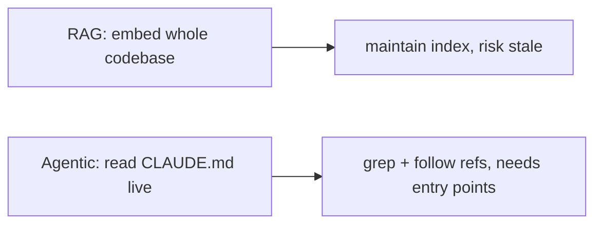

# Claude Code in Large Codebases

原文：Anthropic, May 14, 2026。這份 walkthrough 是我看完之後幫我們團隊濾過的版本，不是 summary。

sourceUrl: https://claude.com/blog/how-claude-code-works-in-large-codebases-best-practices-and-where-to-start 
sourceSnapshot: docs/external/2026-05-24-claude-code-large-codebases.md 
sourceFetched: 2026-05-24 · status: generated-derivative · lastRegenerated: 2026-05-24

<NarrationCue :text="`我先說結論：這篇 Anthropic best practices 我建議我們團隊用一週吸收，但不該全盤照搬。[h:span-source]這份 walkthrough 是我看完原文後幫我們團隊濾過的版本[/h]，不是 summary。[h:card-source]右下角的 sourceUrl 和 sourceSnapshot 我都留著[/h]，因為原文以後可能會改，但我這份建議是針對 5/24 那個版本做的。`" />

<!--
我先說結論：這篇 Anthropic best practices 我建議我們團隊用一週吸收，但不該全盤照搬。[h:span-source]這份 walkthrough 是我看完原文後幫我們團隊濾過的版本[/h]，不是 summary。[h:card-source]右下角的 sourceUrl 和 sourceSnapshot 我都留著[/h]，因為原文以後可能會改，但我這份建議是針對 5/24 那個版本做的。
-->

---

# 為什麼這篇對我們現在重要

我們 repo 還沒到 multi-million-line 規模，但 Claude Code 的接入方式已經從個人技巧變成 team-level infrastructure 議題。

  

    <strong>現況：個人技巧階段</strong>
    
每個工程師自己摸 Claude Code。CLAUDE.md 多半沒寫，寫了也沒人維護。skill / plugin 各自收藏。

  

  

    <strong>下一季要去：Team infra 階段</strong>
    
Layered CLAUDE.md、curated skills、共用 plugin、明確 governance。Claude Code 變成像 CI 一樣的共享基礎設施。

  

  

    <strong>拖延成本</strong>
    
等大家各自摸出一套不一致的設定，再來統一比現在貴：習慣已經形成、CLAUDE.md 內容會打架。

  

<NarrationCue :text="`我推薦這篇的真正理由不是它寫得新，而是它把 Claude Code 從個人技巧定位成 team infrastructure。[h:card-individual]左邊灰藍色這格是我們現在的位置：每個工程師自己摸[/h]。[h:card-team-infra]中間天藍色這格是我認為下一季要去的地方[/h]，treat Claude Code 像 CI 一樣。[h:card-cost-of-waiting]右邊琥珀色我特別標出來的是拖延成本[/h]：等大家各自摸成不一致的設定，再來整合會比現在貴很多。`" />

<!--
我推薦這篇的真正理由不是它寫得新，而是它把 Claude Code 從個人技巧定位成 team infrastructure。[h:card-individual]左邊灰藍色這格是我們現在的位置：每個工程師自己摸[/h]。[h:card-team-infra]中間天藍色這格是我認為下一季要去的地方[/h]，treat Claude Code 像 CI 一樣。[h:card-cost-of-waiting]右邊琥珀色我特別標出來的是拖延成本[/h]：等大家各自摸成不一致的設定，再來整合會比現在貴很多。
-->

---

# 原文範圍 vs. 我這份 walkthrough 的取捨

先把原文範圍攤開，讓你知道我刻意跳過哪些；我不假裝這是完整翻譯。

  

    <strong>原文涵蓋（10 個主題）</strong>
    
7 個 extension points：CLAUDE.md、Hooks、Skills、Plugins、LSP、MCP servers、Subagents。 
    3 個組織 pattern：codebase 導覽、配置維護週期、ownership / DRI。

  

  

    <strong>本 walkthrough 會展開（4 個）</strong>
    
CLAUDE.md hierarchy、Skills vs. CLAUDE.md 邊界、配置維護週期、DRI / agent manager。 
    LSP / MCP / Subagent 我刻意延後，理由放在「Where I push back」。

  

<NarrationCue :text="`我先把原文範圍攤開，讓你知道我刻意跳過哪些。[h:card-coverage]左邊這格是原文涵蓋的 10 個主題：7 個 extension points 加 3 個組織 pattern[/h]。[h:card-scope]右邊這格才是這份 walkthrough 真的會展開的四個[/h]：CLAUDE.md hierarchy、skill 邊界、配置維護週期、組織 DRI。LSP、MCP、subagent 對我們現階段太早，我會在倒數第二張說明為什麼延後。`" />

<!--
我先把原文範圍攤開，讓你知道我刻意跳過哪些。[h:card-coverage]左邊這格是原文涵蓋的 10 個主題：7 個 extension points 加 3 個組織 pattern[/h]。[h:card-scope]右邊這格才是這份 walkthrough 真的會展開的四個[/h]：CLAUDE.md hierarchy、skill 邊界、配置維護週期、組織 DRI。LSP、MCP、subagent 對我們現階段太早，我會在倒數第二張說明為什麼延後。
-->

---

# 核心觀念：Agentic search，不是 RAG

Claude Code 走 agentic search 路線。我建議我們不要再規劃自家 codebase embedding 服務。

對我們的意義：投資應該從 embedding pipeline 轉到「讓 Claude 找得到入口」，也就是 CLAUDE.md 與 .claudeignore。

<NarrationCue :text="`我建議我們不要再花力氣建自家 codebase embedding，理由就在這張圖。[h:diagram-comparison]圖上左邊 RAG 路線要養 index、處理 staleness、付儲存；右邊 agentic search 直接走 filesystem[/h]。原文沒明說但很關鍵的是：agentic 的成本不是消失，而是轉嫁到「Claude 有沒有入口」。[h:card-implication]所以下面這條我特別標出來的啟示[/h]：我們的投資應該轉到 CLAUDE.md 和 .claudeignore，不是 embedding pipeline。`" />

<!--
我建議我們不要再花力氣建自家 codebase embedding，理由就在這張圖。[h:diagram-comparison]圖上左邊 RAG 路線要養 index、處理 staleness、付儲存；右邊 agentic search 直接走 filesystem[/h]。原文沒明說但很關鍵的是：agentic 的成本不是消失，而是轉嫁到「Claude 有沒有入口」。[h:card-implication]所以下面這條我特別標出來的啟示[/h]：我們的投資應該轉到 CLAUDE.md 和 .claudeignore，不是 embedding pipeline。
-->

---

# Harness 七元件 ＋ 我給我們團隊的優先級

<table class="compact-table">
  <thead>
    <tr>
      <th>元件</th>
      <th>載入時機</th>
      <th>最適用途</th>
      <th>我們團隊的優先級</th>
    </tr>
  </thead>
  <tbody>
    <tr data-walkthrough-anchor="row-claude-md">
      <td><strong>CLAUDE.md</strong></td>
      <td>每次 session 自動</td>
      <td>專案 convention、目錄結構、gotcha</td>
      <td><strong style="color: #7dd3fc;">P0 — 我們連 root 都還沒寫</strong></td>
    </tr>
    <tr data-walkthrough-anchor="row-hooks">
      <td><strong>Hooks</strong></td>
      <td>事件觸發</td>
      <td>自動化重複行為、收斂 session learning</td>
      <td>P1 — 等 CLAUDE.md 穩了再加 stop hook</td>
    </tr>
    <tr data-walkthrough-anchor="row-skills">
      <td><strong>Skills</strong></td>
      <td>On demand</td>
      <td>可重用的 workflow / expertise</td>
      <td><strong style="color: #7dd3fc;">P1 — 我們有人在用但沒治理</strong></td>
    </tr>
    <tr data-walkthrough-anchor="row-plugins">
      <td><strong>Plugins</strong></td>
      <td>配置後常駐</td>
      <td>把 skills / hooks / MCP 打包分發</td>
      <td><strong style="color: #7dd3fc;">P1 — 散落需要 marketplace 統一</strong></td>
    </tr>
    <tr data-walkthrough-anchor="row-lsp">
      <td><strong>LSP</strong></td>
      <td>配置後常駐</td>
      <td>Symbol-level 精準導覽</td>
      <td style="color: #94a3b8;">P2 — 我們主力語言 LSP 還沒齊</td>
    </tr>
    <tr data-walkthrough-anchor="row-mcp">
      <td><strong>MCP servers</strong></td>
      <td>配置後常駐</td>
      <td>連接內部工具與資料</td>
      <td style="color: #94a3b8;">P2 — 內部 service catalog 還沒結構化</td>
    </tr>
    <tr data-walkthrough-anchor="row-subagent">
      <td><strong>Subagents</strong></td>
      <td>顯式呼叫</td>
      <td>探索 / 編輯隔離、平行</td>
      <td style="color: #94a3b8;">P2 — 現在 PR 規模還不需要</td>
    </tr>
  </tbody>
</table>

<NarrationCue :text="`我把原文的元件對照表重排，加了「我們團隊優先級」這欄。[h:row-claude-md]最上面這列 CLAUDE.md 我排 P0[/h]，因為我們連 root 都還沒寫，後面所有規則都白談。[h:row-skills,row-plugins]中間 skills 和 plugins 我排 P1[/h]，已經有人在用但沒治理，再不收會碎掉。[h:row-lsp,row-mcp,row-subagent]下面三列灰色的我刻意排 P2[/h]，不是它們不好，而是基礎沒鋪好就投入這些等於蓋空中樓閣。`" />

<!--
我把原文的元件對照表重排，加了「我們團隊優先級」這欄。[h:row-claude-md]最上面這列 CLAUDE.md 我排 P0[/h]，因為我們連 root 都還沒寫，後面所有規則都白談。[h:row-skills,row-plugins]中間 skills 和 plugins 我排 P1[/h]，已經有人在用但沒治理，再不收會碎掉。[h:row-lsp,row-mcp,row-subagent]下面三列灰色的我刻意排 P2[/h]，不是它們不好，而是基礎沒鋪好就投入這些等於蓋空中樓閣。
-->

---

# 建議一：CLAUDE.md 用 hierarchy，不要單一檔

Root 放 pointer，subdir 放本地細節，.claudeignore 集中濾雜訊。Claude 會 walk up 樹自動加總。

  

    <strong>Root CLAUDE.md</strong>
    
30 行內。只放整個 repo 的結構 pointer 與三條 critical gotcha。不放 service-specific 細節。

  

  

    <strong>Subdirectory CLAUDE.md</strong>
    
放本地 convention、scope 過的 test / lint 指令。避免 Claude 改一個 service 卻跑整個 monorepo 的 suite。

  

  

    <strong>.claudeignore + permissions.deny</strong>
    
擋 build artifact、generated code、third-party。原文強調用 version-controlled deny rules 讓全隊一致。

  

<NarrationCue :text="`我認為這篇最立刻可用的建議就是這頁。[h:card-root]左邊 root CLAUDE.md[/h] 要瘦：只放 pointer 和 critical gotcha，不要塞細節。[h:card-subdir]中間 subdirectory CLAUDE.md[/h] 把 test 和 lint 指令 scope 在該層，避免每次燒 context 跑全 suite。[h:card-ignore]右邊 .claudeignore 我們現在完全沒用[/h]，光是擋掉 build artifact 我估計就能省 20% context。三件可以這週做完。`" />

<!--
我認為這篇最立刻可用的建議就是這頁。[h:card-root]左邊 root CLAUDE.md[/h] 要瘦：只放 pointer 和 critical gotcha，不要塞細節。[h:card-subdir]中間 subdirectory CLAUDE.md[/h] 把 test 和 lint 指令 scope 在該層，避免每次燒 context 跑全 suite。[h:card-ignore]右邊 .claudeignore 我們現在完全沒用[/h]，光是擋掉 build artifact 我估計就能省 20% context。三件可以這週做完。
-->

---

# 建議二：Skills vs. CLAUDE.md，邊界要清楚

可重用的專長屬於 Skill；專案綁死的 convention 才該進 CLAUDE.md。混在一起，CLAUDE.md 會變又長又通用，效能退化。

  

    <strong>該放 CLAUDE.md</strong>
    
跟這個 repo 綁死的內容：目錄結構、命名 convention、為什麼某個模組看起來奇怪、PR review checklist。 
    <em>判準：換一個 repo 就不適用。</em>

  

  

    <strong>該抽成 Skill</strong>
    
跨專案可重用的 workflow：跑 db migration、寫 RFC 草稿、做 release notes、追 incident timeline。 
    <em>判準：在三個以上 repo 都用得到。</em>

  

我們團隊的現有 anti-pattern：所有「希望 Claude 知道的事」都塞進 CLAUDE.md。結果是檔案膨脹到 600 行，每個 session 都背一遍，context 浪費。

<NarrationCue :text="`這頁我要 push back 一個我們團隊的習慣：什麼都塞進 CLAUDE.md。[h:card-claude-md-belong]左邊這格才是真正屬於 CLAUDE.md 的內容[/h]：跟這個 repo 綁死的 convention 和 gotcha。[h:card-skill-belong]右邊這格屬於 skill[/h]：可重用的 workflow，例如「跑 db migration」。[h:card-anti-pattern]下面紅色那條是我們的現況[/h]：CLAUDE.md 膨脹到 600 行，每個 session 都背一遍，context 浪費。判準我給得很簡單：換 repo 還用得到就抽成 skill。`" />

<!--
這頁我要 push back 一個我們團隊的習慣：什麼都塞進 CLAUDE.md。[h:card-claude-md-belong]左邊這格才是真正屬於 CLAUDE.md 的內容[/h]：跟這個 repo 綁死的 convention 和 gotcha。[h:card-skill-belong]右邊這格屬於 skill[/h]：可重用的 workflow，例如「跑 db migration」。[h:card-anti-pattern]下面紅色那條是我們的現況[/h]：CLAUDE.md 膨脹到 600 行，每個 session 都背一遍，context 浪費。判準我給得很簡單：換 repo 還用得到就抽成 skill。
-->

---

# 建議三：每季 review 配置，否則它會反過來限制新模型

為舊模型寫的 workaround 不會自動消失。每 3-6 個月、或遇到大模型升級時，主動 review，否則 config 從「補強」變「枷鎖」。

  

    <strong>過時 workaround 的典型樣貌</strong>
    
「請把 refactor 拆成單檔修改」這條原本是為了避免舊模型跨檔混亂。新模型本來能做 coordinated cross-file edit，卻被這條規則限制。

  

  

    <strong>我建議的節奏</strong>
    
每季一次配著 release note review，加上每次大改版（如 Sonnet → Opus 升級）立刻做一次。把這件事排進 quarterly ops sync。

  

<NarrationCue :text="`這頁是我最想說服你接受的點：config 會過時，而且會反過來限制新模型。[h:card-rotting]左邊這格示範什麼叫過時 workaround[/h]：為了補舊模型弱點寫的規則，反而限制了新模型本來能做的事。[h:card-cadence]右邊是我建議的節奏：每季一次配 release note[/h]，再加上大改版立刻做一次。我承擔的風險是這件事容易被推遲，所以我會把它排進 quarterly ops sync 的固定 agenda，不靠記憶。`" />

<!--
這頁是我最想說服你接受的點：config 會過時，而且會反過來限制新模型。[h:card-rotting]左邊這格示範什麼叫過時 workaround[/h]：為了補舊模型弱點寫的規則，反而限制了新模型本來能做的事。[h:card-cadence]右邊是我建議的節奏：每季一次配 release note[/h]，再加上大改版立刻做一次。我承擔的風險是這件事容易被推遲，所以我會把它排進 quarterly ops sync 的固定 agenda，不靠記憶。
-->

---

# 建議四：要 DRI，不要新團隊

原文鼓吹「agent manager」職位。我建議我們現階段先設一個 DRI，等規模到位再升級成團隊。

  

    <strong>沒 DRI 的後果</strong>
    
每個小組各搞一套 CLAUDE.md / skill / hook。新人入職要學三套設定。決策無人追溯。

  

  

    <strong>我建議的最小可行單位</strong>
    
一個被授權的工程師（DRI），有權核可 CLAUDE.md 改動、curate skill marketplace、訂 permission default。

  

  

    <strong>Future：完整 agent manager 團隊</strong>
    
原文描述的 PM / engineer hybrid 角色。我認為我們規模到 100 人以上、跨 BU 才需要。

  

<NarrationCue :text="`我推 DRI 這個概念，但不推「立刻成立新團隊」。[h:card-fragment]左邊灰藍色那格是沒 DRI 的後果[/h]：每個小組各搞一套，新人入職要學三套 CLAUDE.md，知識永遠停在小圈圈。[h:card-dri]中間天藍色這格是我建議的最小可行單位：一個被授權的工程師[/h]，有權核可改動、curate skill、訂 permission。[h:card-team]右邊琥珀色那格我刻意標 future[/h]：完整 agent manager 團隊在我們現在規模不必要，現在做反而變 process overhead。`" />

<!--
我推 DRI 這個概念，但不推「立刻成立新團隊」。[h:card-fragment]左邊灰藍色那格是沒 DRI 的後果[/h]：每個小組各搞一套，新人入職要學三套 CLAUDE.md，知識永遠停在小圈圈。[h:card-dri]中間天藍色這格是我建議的最小可行單位：一個被授權的工程師[/h]，有權核可改動、curate skill、訂 permission。[h:card-team]右邊琥珀色那格我刻意標 future[/h]：完整 agent manager 團隊在我們現在規模不必要，現在做反而變 process overhead。
-->

---

# Where to start — 這週做的三件事

不是寫完整 spec，是讓 Claude Code 從「個人技巧」往「team infra」走出第一步。三件加起來不到一個下午。

  

    <strong>① Root CLAUDE.md（30 行內）</strong>
    列出 repo 結構（services/、infra/、docs/）、三條 critical gotcha（如「永遠不要直接改 vendor/」）、指向各 subdir CLAUDE.md。
  

  

    <strong>② 一個 subdir CLAUDE.md</strong>
    挑最常被 Claude 改的 service（我猜是 services/api），加 subdirectory CLAUDE.md：本地 convention + scope 過的 npm test / lint 指令。
  

  

    <strong>③ .claudeignore</strong>
    擋掉 dist/、build/、node_modules/、generated/。估計能省 20% context。順手在 .claude/settings.json 加 permissions.deny。
  

驗證指標：下次 Claude 在 services/api 改檔時，它應該自動只跑該 service 的 test，不再跑整個 monorepo。

<NarrationCue :text="`我給你的 Monday action 就這三件。[h:step-1]第一格 root CLAUDE.md，30 行內[/h]，只放 repo 結構、三條 gotcha、指向各 subdir。[h:step-2]第二格挑一個最常被 Claude 改的 service 加 subdirectory CLAUDE.md[/h]，scope 該層的 test 指令。[h:step-3]第三格 .claudeignore 把 dist 和 node_modules 擋掉[/h]，估計省 20% context。[h:card-success-metric]下面這條是驗證指標[/h]：下次 Claude 改 services/api 時，它應該只跑該 service 的 test。`" />

<!--
我給你的 Monday action 就這三件。[h:step-1]第一格 root CLAUDE.md，30 行內[/h]，只放 repo 結構、三條 gotcha、指向各 subdir。[h:step-2]第二格挑一個最常被 Claude 改的 service 加 subdirectory CLAUDE.md[/h]，scope 該層的 test 指令。[h:step-3]第三格 .claudeignore 把 dist 和 node_modules 擋掉[/h]，估計省 20% context。[h:card-success-metric]下面這條是驗證指標[/h]：下次 Claude 改 services/api 時，它應該只跑該 service 的 test。
-->

---

# Where I push back / skip — 兩個我請我們延後的點

  

    <strong>延後：MCP servers</strong>
    
原文鼓勵把 internal tools / data 暴露成 MCP。我們現在 internal service catalog 還沒結構化到值得被 Claude 結構化呼叫，先投入是把混亂包裝得更複雜。 
    <em>觸發條件：當 service catalog 進入 v1 後，再回來評估。</em>

  

  

    <strong>延後：Subagents 拆分</strong>
    
原文把 exploration / editing 拆給不同 subagent。我們現在 PR 規模還沒大到需要這層隔離；強行拆會讓 review 流程變複雜。 
    <em>觸發條件：當單一 PR 經常超過 30 檔，再回來看。</em>

  

我的判準：兩者都不是錯方向，只是順序。先把 CLAUDE.md 和 skills 跑順，這兩個再回頭看，會省一輪重做。

<NarrationCue :text="`這頁是我從原文挑出來、會請我們延後的兩件事。[h:card-mcp-pushback]左邊這格是 MCP[/h]：原文很推，但我們 internal service catalog 還沒結構化到值得被 Claude 呼叫，先投入是把混亂包裝得更複雜。[h:card-subagent-pushback]右邊這格是 subagent[/h]：我們 PR 規模還沒大到需要 exploration 和 editing 分離。[h:card-pushback-rule]下面琥珀色這條是我的判準[/h]：兩者不是錯方向，只是順序。先把基礎跑順，再回頭看會省一輪重做。`" />

<!--
這頁是我從原文挑出來、會請我們延後的兩件事。[h:card-mcp-pushback]左邊這格是 MCP[/h]：原文很推，但我們 internal service catalog 還沒結構化到值得被 Claude 呼叫，先投入是把混亂包裝得更複雜。[h:card-subagent-pushback]右邊這格是 subagent[/h]：我們 PR 規模還沒大到需要 exploration 和 editing 分離。[h:card-pushback-rule]下面琥珀色這條是我的判準[/h]：兩者不是錯方向，只是順序。先把基礎跑順，再回頭看會省一輪重做。
-->

---

# 還沒解答的三題 + 下一份該讀的

<table class="compact-table">
  <thead>
    <tr>
      <th>未解問題</th>
      <th>我目前的傾向</th>
      <th>需要的驗證</th>
    </tr>
  </thead>
  <tbody>
    <tr data-walkthrough-anchor="row-q1">
      <td><strong>Q1</strong> 我們 repo 規模比原文小一個量級，這些 pattern 縮小後還適用嗎？</td>
      <td>傾向適用，但 hierarchy 的層數可能 1-2 層就夠。</td>
      <td>實作 root + 一個 subdir 後觀察 context 使用量。</td>
    </tr>
    <tr data-walkthrough-anchor="row-q2">
      <td><strong>Q2</strong> AI-generated PR 的 governance 我們還沒有特殊流程。</td>
      <td>傾向先加 PR template 欄位「是否含 Claude 生成內容」，不立刻加 review 流程。</td>
      <td>跑兩個月後看是否需要強制 reviewer。</td>
    </tr>
    <tr data-walkthrough-anchor="row-q3">
      <td><strong>Q3</strong> Skill / plugin 內部 distribution 機制。</td>
      <td>傾向用 internal marketplace，但原文沒展開。</td>
      <td>下一份該讀：找 Anthropic 的 plugin marketplace 官方文件。</td>
    </tr>
  </tbody>
</table>

<NarrationCue :text="`最後留三個我還沒解答的問題。[h:row-q1]第一題我們 repo 規模比原文小一個量級[/h]，這些 pattern 縮小後還適用嗎？我傾向適用，但 hierarchy 層數可能 1-2 層就夠，需要實作後觀察。[h:row-q2]第二題是 governance[/h]：我傾向先加 PR template 欄位，不立刻加強制 review。[h:row-q3]第三題是下一份該讀的[/h]：原文沒展開的 plugin marketplace 機制，我會去找對應官方文件。這三題我不裝懂，等驗證再回來更新這份 walkthrough。`" />

<!--
最後留三個我還沒解答的問題。[h:row-q1]第一題我們 repo 規模比原文小一個量級[/h]，這些 pattern 縮小後還適用嗎？我傾向適用，但 hierarchy 層數可能 1-2 層就夠，需要實作後觀察。[h:row-q2]第二題是 governance[/h]：我傾向先加 PR template 欄位，不立刻加強制 review。[h:row-q3]第三題是下一份該讀的[/h]：原文沒展開的 plugin marketplace 機制，我會去找對應官方文件。這三題我不裝懂，等驗證再回來更新這份 walkthrough。
-->
